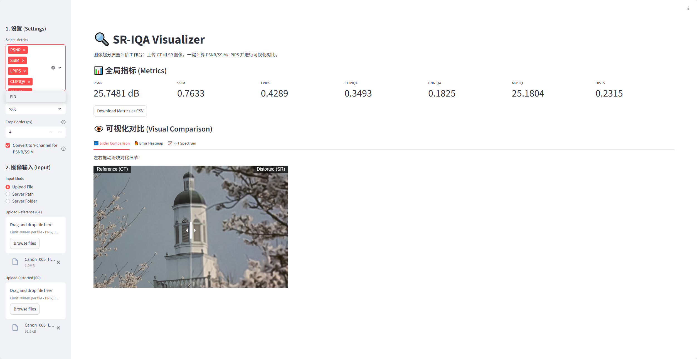

# SR-IQA Visualization

A lightweight web-based tool for Image Quality Assessment(IQA). Built with Streamlit and PyIQA, it provides a comprehensive suite of metrics and visualization tools for researchers to evaluate and compare model results efficiently.



## ✨ Features

### 1. Comprehensive Metrics Support

Calculate a wide range of Full-Reference (FR) and No-Reference (NR) metrics:

- **Standard**: PSNR, SSIM
- **Perceptual**: LPIPS, DISTS, FID
- **No-Reference**: CLIPIQA, CNNIQA, MUSIQ
- _Customizable selection via sidebar._

### 2. Flexible Input Modes

- **Upload File**: Drag & drop local images.
- **Server Path**: Direct input of absolute file paths on the server.
- **Server Folder (Batch Mode)**: Point to GT and SR folders to browse and evaluate the entire dataset image by image with navigation buttons (Previous/Next).

### 3. Advanced Visualization

- **Slider Comparison**: Interactive "Before/After" slider to inspect restoration details.
- **Error Heatmap**: Visualize pixel-wise absolute differences.
- **FFT Spectrum**: Frequency domain analysis to detect artifacts or high-frequency loss.
- **ROI Crop & Zoom**: Draw a custom rectangular box on the reference image to inspect specific regions with 4x magnification.

## 🛠️ Installation

1.  **Clone the repository**:

    ```bash
    git clone git@github.com:XuBao12/IQA-Visualization.git
    cd sr-iqa-visualizer
    ```

2.  **Install dependencies**:
    ```bash
    pip install -r requirements.txt
    ```

## 🚀 Usage

1.  **Start the application**:

    ```bash
    python -m streamlit run app.py
    ```

2.  **Configure Settings (Sidebar)**:

    - **Select Metrics**: Choose which metrics to calculate (e.g., PSNR, SSIM, LPIPS, MUSIQ...).
    - **LPIPS Backbone**: VGG or Alex.
    - **Crop Border**: Pixels to ignore around the edges (standard practice in SR).

3.  **Select Input Mode**:
    - **Upload File**: Good for quick checks of local files.
    - **Server Path**: Good for checking specific files on the remote server.
    - **Server Folder**: Best for browsing results. Ensure filenames in GT and SR folders match.

## 📂 Project Structure

```
.
├── app.py              # Main Streamlit application
├── utils.py            # Helper functions (Metrics, I/O, Preprocessing)
├── requirements.txt    # Python dependencies
└── README.md           # Documentation
```

## 📝 Notes

- **First Run**: When selecting metrics like MUSIQ or FID for the first time, `pyiqa` will automatically download the pretrained weights. This may take a few minutes.
- **FID**: Calculated on single image pairs here, which is an approximation. Standard FID is calculated on distributions.
